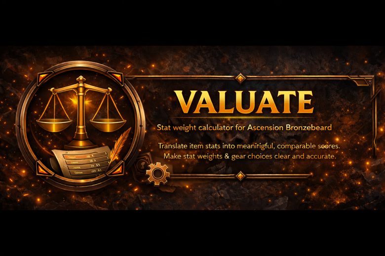
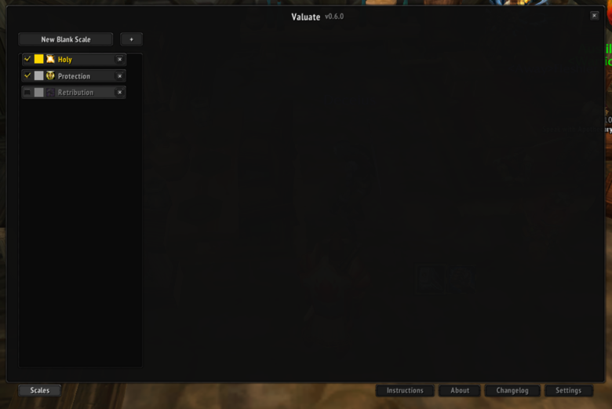
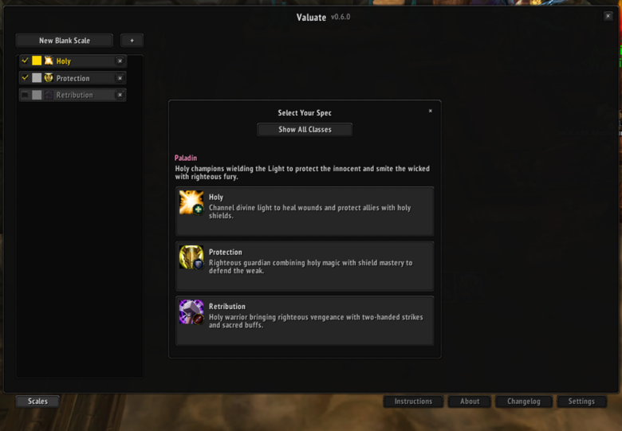
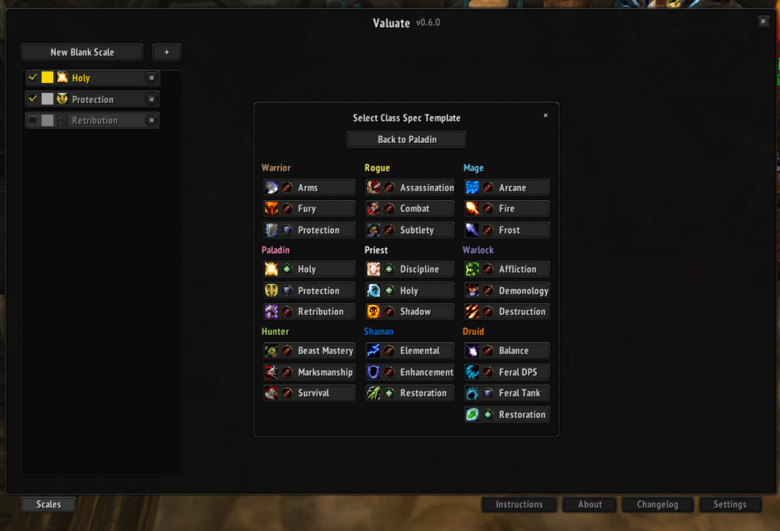
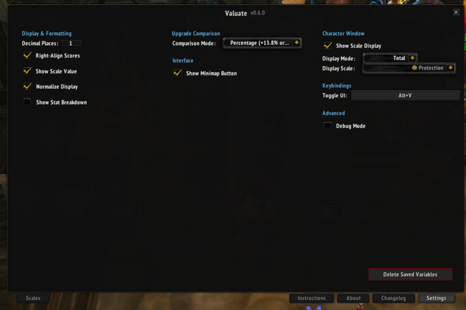
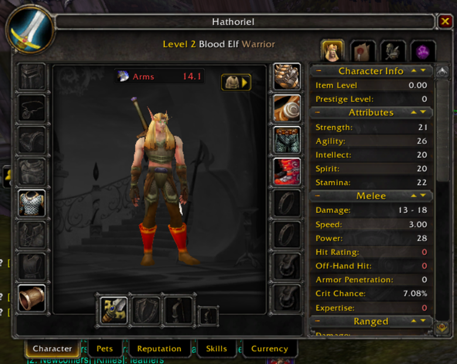
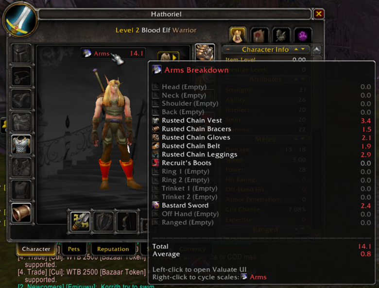
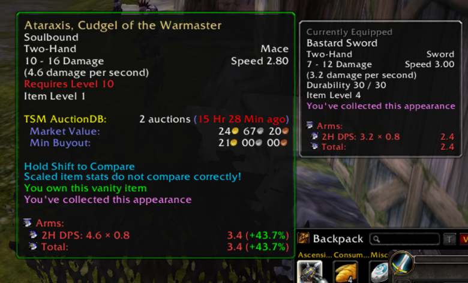
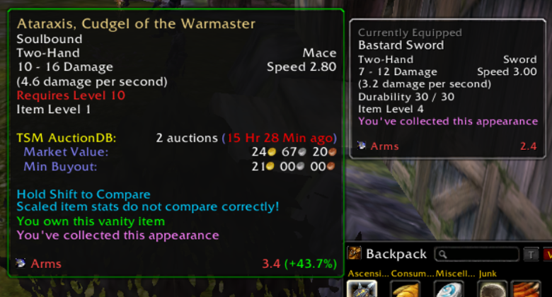

# Valuate
Stat weight item scoring for World of Warcraft: Ascension Bronzebeard (WotLK 3.3.5a).

  

## What it does
Valuate evaluates gear using stat weights you define, then surfaces that score directly in tooltips and the UI. The aim is clarity. You can see at a glance how an item fits your build, without guessing or mentally juggling stats.

## Highlights
- Custom stat weight scales tailored to your build
- Clean, readable scoring directly in tooltips
- Import and export scales to share or reuse setups
- Per-character profiles (v0.7.0+) so each character keeps independent scales and settings
- Lightweight and fast, designed to stay out of your way while you play

## Screenshots

  
  

  
  

  
  

  
  

## Install
1. Download the latest release:
   - https://github.com/mrjessecallaghan/Valuate/releases
2. Extract the folder into your AddOns directory:
   - For most WotLK clients: `World of Warcraft/Interface/AddOns/`
3. Confirm the folder structure:
   - `.../Interface/AddOns/Valuate/`
   - and that it contains `Valuate.toc`
4. Launch the game and enable Valuate in the AddOns list.

## Quick start
- Open the options with `/valuate`
- Create or adjust a stat weight scale
- Hover over items to see their score

### Import and export
- Export a scale:
  - `/valuate export ScaleName`
- Import a scale:
  - `/valuate import`
  - Paste the scale tag when prompted

## Profiles (v0.7.0+)
Valuate stores settings per character, which makes managing multiple builds far simpler.

This means:
- Changing a scale on one character won’t affect others
- UI preferences are saved per character
- Reusing a scale is as simple as exporting and importing it

### Upgrade note for existing users
If you upgraded to v0.7.0 or later and want to clean up older data, you can remove the old account-wide file after confirming everything works as expected:

- Old account-wide file:
  - `WTF-Account/[account]/SavedVariables/Valuate.lua`
- New per-character file:
  - `WTF-Account/[account]/[realm]/[character]/SavedVariables/Valuate.lua`

## How scoring works
Valuate multiplies each stat on an item by the weight you assign to that stat, then sums the results into a single score.

The accuracy of the result depends entirely on your weights. Well-tuned weights produce clear upgrade decisions. Poor weights will not.

## Troubleshooting
- Scores not showing:
  - Make sure the addon is enabled at character select
  - Confirm the folder is named `Valuate` and contains `Valuate.toc`
  - Temporarily disable other tooltip addons to check for conflicts
- Import not working:
  - Confirm the full scale string was copied
  - Try pasting it into a plain text editor first to remove formatting

## Roadmap
- Improved default and example scales
- Expanded tooltip display options
- Continued polish and performance improvements

## Bugs and feature requests
If you run into issues or have ideas, open an issue here:
- https://github.com/mrjessecallaghan/Valuate/issues

Helpful details to include:
- What you expected versus what happened
- Screenshots for visual issues
- Your scale export string if scoring is involved
- The item link and where it appeared

## Contact
- Discord: jessecallaghan  
- Ko-fi: https://ko-fi.com/jessecallaghan